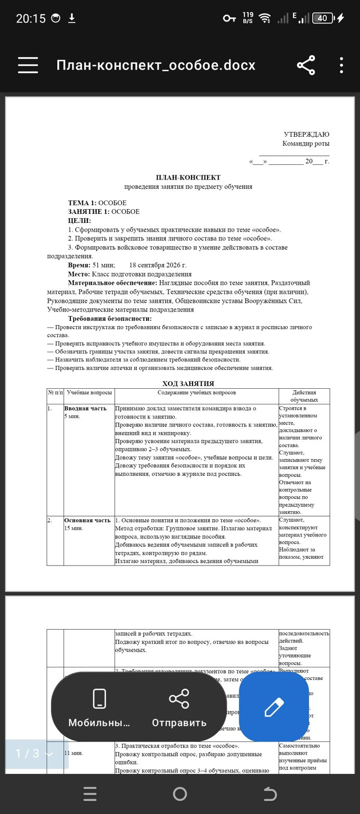

# План-конспект

**Конструктор планов-конспектов для командира взвода. Работает офлайн.**

Вводите тему и время — получаете готовый документ по установленной форме: гриф утверждения, ТЕМА и ЗАНЯТИЕ, цели, время, место, материальное обеспечение, требования безопасности, ход занятия таблицей в четыре графы, подпись руководителя.

То, на что уходит вечер, собирается за пару минут. Дальше правится руками и печатается.

Приложение опирается на ваши же материалы: берёт содержание из приложенных методичек, перенимает формулировки из прошлых конспектов и загруженных документов. Чем больше через него пропущено, тем меньше остаётся править.

Ни одного разрешения, ни одного сетевого запроса. Всё хранится в памяти телефона.

**[Как работать с приложением](docs/РАБОТА.md)** — руководство на десять минут.

## Как выглядит

<table>
<tr>
<td width="42%"></td>
<td valign="top">

Готовый документ по установленной форме:

- гриф утверждения с датой в графах
- ТЕМА и ЗАНЯТИЕ, цели нумерованным списком
- время, место, материальное обеспечение
- требования безопасности
- ход занятия таблицей в четыре графы
- подпись руководителя

Выгружается в Word и печатается через системный диалог, оттуда же «Сохранить в PDF».

Остальные снимки — [`docs/README.md`](docs/README.md).

</td>
</tr>
</table>

## Установка

Скачайте APK со страницы [Releases](../../releases/latest) и откройте его на телефоне. Android спросит разрешение на установку из этого источника — это обычное дело для приложений не из магазина.

Нужен Android 7.0 или новее. Приложение подписано, отдельных действий не требует.

При первом запуске в архиве лежит показательный конспект: откройте его, посмотрите, что получается на выходе, и удалите.

## Что делает

- **Собирает документ по форме.** Гриф утверждения с датой в графах, ТЕМА и ЗАНЯТИЕ прописными, цели нумерованным списком, время с разбивкой по частям, ход занятия таблицей.
- **Берёт содержание из ваших методичек.** При сборке ищет в приложенных файлах разделы по словам учебного вопроса и вставляет найденное. Видно, что откуда взято.
- **Перенимает ваш язык.** Из загруженных конспектов и правок запоминает, как формулируете вы, и подставляет вместо общевойсковых заготовок — по каждому предмету отдельно.
- **Делит время по объёму содержания**, а не поровну. Любое число минут, не обязательно кратное пяти.
- **Проверяет документ перед сдачей** — восемнадцать правил: сходится ли время, есть ли дата и подразделение, не пуст ли вопрос, есть ли требования безопасности на практическом занятии, отвечают ли цели учебным вопросам.
- **Правка любого раздела**, включая перестройку учебных вопросов: разделить, слить, добавить, удалить.
- **Программа подготовки** — знает, какое занятие следующее, и собирает его одной кнопкой; отметка о проведении закрывает пункт.
- **Серия занятий** — одна тема, несколько заготовок разом.
- **Архив** с поиском, копированием, отметками о проведении и передачей занятий товарищам.
- **Справочные материалы** — методички под рукой и поиск по ним.
- **Загрузка чужих конспектов** любой вёрстки, вместе с рисунками и схемами.
- **Резервная копия** всего одним файлом.

## Предметы обучения

Тактическая, огневая, строевая, физическая подготовка, общевоинские уставы, РХБ защита, военная топография, военно-медицинская, инженерная подготовка, связь, военно-политическая, техническая и специальная подготовка, плюс универсальный шаблон для всего остального. У каждого предмета свои формулировки целей, места и методы проведения, перечни пособий и требований безопасности.

## Справочные материалы

Отдельная вкладка. Прикладываете файл — PDF, Word, Excel, картинку, что угодно — и указываете, к какому предмету он относится (или отмечаете общим для всех). Файл копируется внутрь приложения, поэтому остаётся доступен, даже если исходный удалить или переставить.

На экране собранного конспекта появляется раздел «Материалы к занятию» со списком того, что приложено к этому предмету. Нажатие открывает файл той программой, которая на телефоне за него отвечает. В печатный документ и в отправку раздел не попадает — он только для подготовки.

### Поиск по материалам

При правке конспекта под полем «Содержание» есть кнопка «Взять из материалов». Приложение читает текст приложенных файлов, ищет куски, где встречаются слова из наименования учебного вопроса, и показывает их списком с указанием источника. Отмеченные вставляются в поле.

Это поиск, а не понимание: приложение не разбирает смысл и не решает, что правильно. Оно экономит переписывание от руки, проверка остаётся за руководителем занятия.

Разбираются: `.docx`, `.txt`, `.rtf`, `.html`, `.md`, `.csv`, а также `.doc`, сохранённый как HTML.

Не разбираются: PDF, фотографии и старый двоичный `.doc` — приложение честно говорит об этом и предлагает пересохранить файл в `.docx`. Распознавание текста на снимках не делается: оно ошибается достаточно, чтобы документ приходилось вычитывать целиком, а выигрыша почти не даёт.

Извлечённый текст кешируется, поэтому повторный поиск по толстой методичке идёт быстро.

Материал можно переслать товарищу тем же способом, что и конспект.

## Загрузка старых конспектов

Архив → «Загрузить из файлов». Выбираете сразу несколько своих `.docx`/`.txt`/`.rtf` — приложение разбирает разметку стандартной формы (ТЕМА, ЗАНЯТИЕ, ЦЕЛИ, Время, Место, Материальное обеспечение, части хода занятия) и заводит каждый конспект в архив. Дальше его можно открыть, поправить под новую дату и распечатать.

Из файла берётся только шапка: предмет, тема, номер занятия, время и место — то, по чему занятие узнаётся в архиве. Ход занятия намеренно не разбирается: разобранный текст всё равно не совпал бы с тем, что печатается, и только сбивал бы с толку.

**Загруженный конспект печатается оригиналом.** Пересобрать чужой документ один в один нельзя: вёрстка, таблицы, схемы и рисунки у каждого свои. Поэтому исходный файл хранится рядом с занятием и именно он уходит на печать и в отправку — без единого изменения. Разобранный текст остаётся в архиве для поиска и справки.

Кнопка «Оригинал» на экране конспекта, пункт «Открыть оригинал» в меню архива. Кнопки Word и PDF для таких занятий не показываются — они собрали бы другой документ.

## Типовые темы

У каждого предмета есть перечень типовых тем — в форме кнопка «Выбрать типовую тему» под полем темы. Это только наименования из общевойсковых программ, содержание по-прежнему за вами. Перечень правится в библиотеке наравне с остальными формулировками.

## Программа подготовки

Перечень занятий на период обучения, заводится файлом в настройках. Когда он есть, на экране занятия появляется блок «Следующее по программе» и конспект собирается одной кнопкой: тема, номер занятия и часы берутся из программы, содержание — из приложенных методичек и прошлых конспектов, шапка — из настроек.

Отметили занятие проведённым в архиве — пункт программы закрылся, следующим стало очередное. Видно, сколько занятий и часов осталось.

Формат и пример — [`library/PROGRAMMA.md`](library/PROGRAMMA.md) и [`library/programma-example.json`](library/programma-example.json).

## База конспектов

Готовые занятия выгружаются и загружаются одним JSON-файлом: **Архив → «Сохранить в файл»** и **«Загрузить из файлов»**. Так базу можно собрать на компьютере и раздать по подразделению.

Формат и пример — [`library/LESSONS.md`](library/LESSONS.md) и [`library/lessons-example.json`](library/lessons-example.json).

## Библиотека предметов

Формулировки целей, вопросов, пособий и требований безопасности вынесены из кода в отдельный файл. Встроенный набор лежит внутри APK и доступен всегда. Поверх него можно положить свой:

«Сохранить файл» выгружает текущий набор, «Загрузить файл» принимает поправленный. Правят его на компьютере в любом текстовом редакторе, передают друг другу мессенджером или по Bluetooth.

Битый файл не ставится: приложение сообщит, в каком предмете и поле ошибка, и останется на прежней библиотеке. Кнопка «Вернуть встроенную» откатывает всё.

Формат и пример — в каталоге [`library/`](library/).

## Экспорт

Скопировать в буфер, отправить в мессенджер, выгрузить в Word (настоящий `.docx`), распечатать. В диалоге печати выбирается «Сохранить в PDF».

По умолчанию лист **альбомный**: ход занятия идёт одной таблицей — учебные вопросы и время, действия руководителя, действия обучаемых, — шапка таблицы повторяется на каждой странице. Цели, пособия и раздатка верстаются в две колонки, чтобы не оставалось пустого поля справа. Книжная ориентация переключается в настройках (там ход занятия разбивается по частям на таблицы в две колонки) либо прямо в диалоге печати.

## Сборка

APK собирается в GitHub Actions, локальная среда не нужна.

1. Форкните репозиторий или загрузите содержимое в свой.
2. Откройте вкладку **Actions** — сборка запустится сама после первого push.
3. Через 3–5 минут APK лежит в артефактах прогона: `konspekt-apk`.

Релизная сборка подписывается отладочным ключом, поэтому ставится на телефон без дополнительных действий. Для публикации в магазине подставьте свой keystore в `app/build.gradle.kts`.

Метка вида `v1.0` дополнительно прикладывает APK к релизу:

```bash
git tag v1.0 && git push --tags
```

### Локально

```bash
./gradlew assembleDebug
```

Нужны JDK 17 и Android SDK 34.

## Устройство проекта

```
app/src/main/java/ru/vzvod/konspekt/
├── data/
│   ├── Disciplines.kt    встроенная библиотека: 14 предметов, 104 типовые темы
│   ├── Library.kt         библиотека предметов, своя или встроенная
│   ├── Store.kt           архив, черновик, настройки
│   ├── Program.kt         программа подготовки и учёт пройденного
│   ├── Learned.kt         формулировки, выученные из ваших конспектов
│   ├── Materials.kt       приложенные методички
│   ├── Sources.kt         оригиналы загруженных конспектов
│   ├── FileVault.kt       общее хранилище файлов
│   ├── ShareLesson.kt     передача занятий товарищам
│   ├── Backup.kt          резервная копия одним файлом
│   └── *Json.kt           форматы обмена
├── logic/
│   ├── Generator.kt       сборка документа, расчёт времени
│   ├── DocxWriter.kt      настоящий .docx, таблица и рисунки
│   ├── DocxImages.kt      перенос рисунков и схем из чужих конспектов
│   ├── Renderer.kt        вывод в текст и HTML для печати
│   ├── LessonImport.kt    разбор загруженных конспектов любой вёрстки
│   ├── AutoFill.kt        подстановка из методичек и прошлых занятий
│   ├── Review.kt          нормоконтроль перед сдачей
│   ├── MaterialSearch.kt  поиск по разделам методичек
│   └── TextExtract.kt     чтение файлов разных форматов
├── model/Models.kt        модели данных
├── ui/                    экраны на Jetpack Compose
└── MainActivity.kt
```

Чтобы добавить предмет или поправить формулировки, правьте только `Disciplines.kt` — остальное подстроится. Формат своей библиотеки описан в [`library/README.md`](library/README.md).

## Требования

Android 7.0 и новее.

## Разработчик

В. Д. Кривицкий

## Лицензия

[PolyForm Noncommercial License 1.0.0](LICENSE) — пользоваться, передавать и изменять можно свободно, продавать нельзя. Пересказ по-русски: [`ЛИЦЕНЗИЯ.md`](ЛИЦЕНЗИЯ.md).

Лицензия отдельным пунктом разрешает использование в государственных организациях и воинских частях. Выпуски, вышедшие ранее под GPL-3.0, остаются под ней.

